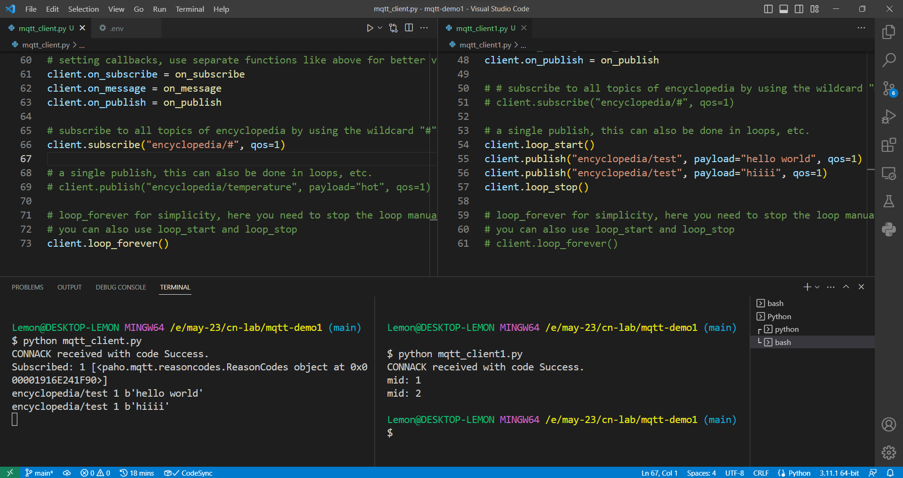

# MQTT demo using paho-mqtt


## Steps to set it up

1. ```bash
    pip install paho-mqtt python-dotenv
    ```

2. Rename .example.env to .env and fill in the values. I have used HiveMQ as a cloud MQTT broker here.

3. Run `python mqtt_client.py` in a terminal to subscribe to encyclopedia/#. Run `python mqtt_client1.py` to publish some messages to encyclopedia/test.